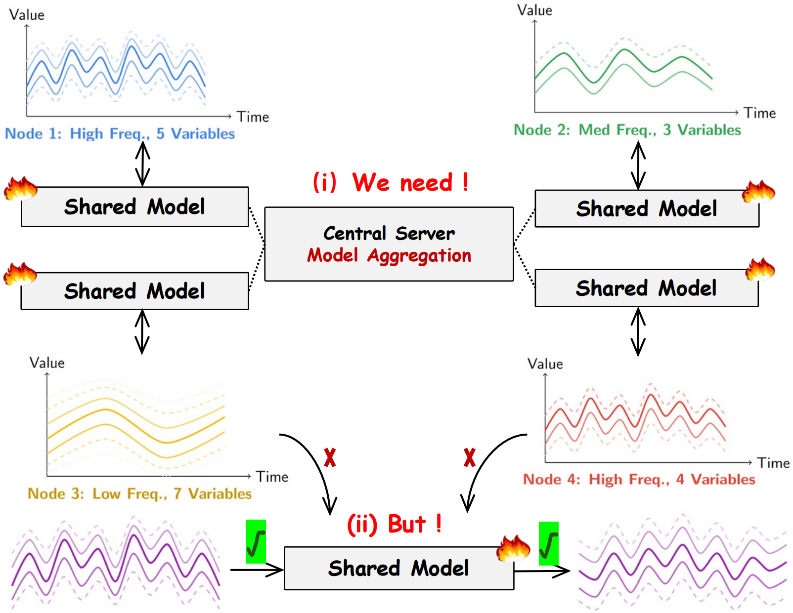
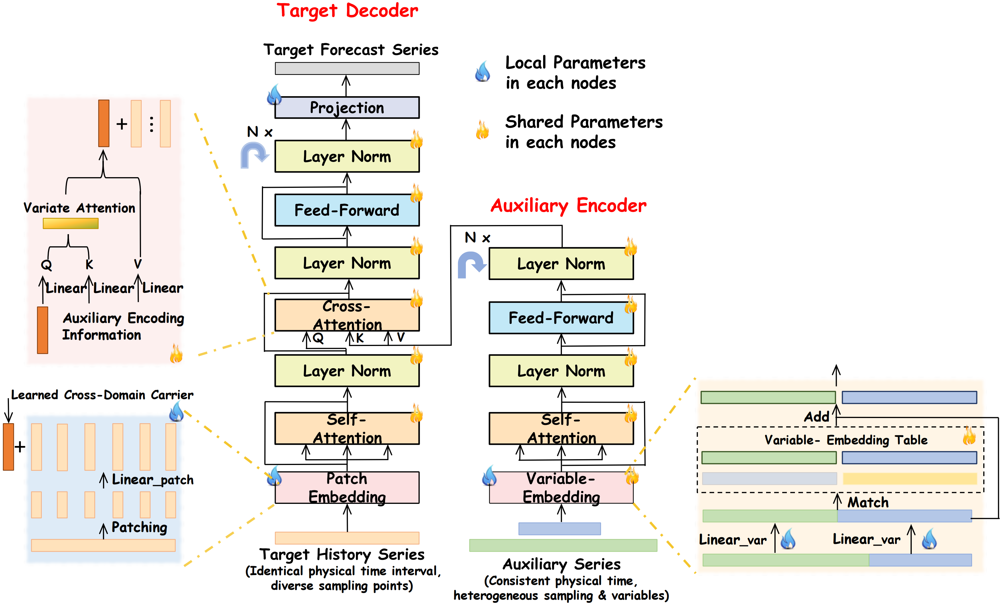

[README.md](https://github.com/user-attachments/files/26165918/README.md)
# PVAT: Patch- and Variable-Aligned Transformer for Structurally Heterogeneous Federated Time-Series Forecasting

> **Accepted at IJCNN 2026**
>
> **Authors:** Dongrui Jiang, Guanghua He*
>
> School of Ocean Engineering, Harbin Institute of Technology, Weihai, China
>
> *Corresponding Author: Guanghua He (ghhe@hitwh.edu.cn)

## Abstract

Federated learning offers a promising paradigm for leveraging distributed time-series data without compromising privacy. However, a fundamental obstacle arises when nodes employ different sampling devices: heterogeneous sampling rates produce time series of varying granularities, and diverse sensor configurations yield inconsistent variable sets across nodes. These structural heterogeneities prevent direct parameter aggregation in conventional federated frameworks.

We propose **PVAT (Patch- and Variable-Aligned Transformer)**, a Transformer-based forecasting model that reconciles structurally heterogeneous data with homogeneous federated aggregation. PVAT introduces two alignment mechanisms:

1. **Patch Embedding for Temporal Alignment**: Segments raw series by fixed physical time intervals and projects variable-length patches into uniform-dimensional tokens, enabling temporal alignment across different sampling rates.

2. **Variable Embedding Table for Semantic Alignment**: A globally synchronized table that assigns learnable semantic vectors to each variable category, ensuring consistent variable semantics network-wide.

<p align="center">
  
</p>

**Figure 1.** Structural heterogeneity in federated time-series forecasting. Nodes with diverse sampling rates and variable sets must collaboratively train a shared model.

<p align="center">
  
</p>

**Figure 2.** The architecture of the proposed PVAT model. PVAT reconciles structural heterogeneity across nodes through Patch-wise Temporal Alignment and Global Variable Alignment mechanisms.

## Requirements

- Python 3.8+
- PyTorch 1.11+

```bash
pip install -r requirements.txt
```

## Project Structure

```
PVAT-code/
├── dataset/                    # Data loading and preprocessing
│   ├── data_factory.py         # Dataset factory
│   ├── data_loader.py          # Data loaders
│   ├── ETT-small/              # ETT datasets (ETTh1, ETTh2, ETTm1, ETTm2)
│   ├── electricity/            # Electricity dataset
│   ├── exchange_rate/          # Exchange rate dataset
│   └── weather/                # Weather dataset
├── models/                     # Model implementations
│   ├── PVAT.py                 # Proposed model
│   ├── iTransformer.py         # iTransformer baseline
│   ├── PatchTST.py             # PatchTST baseline
│   ├── TimeXer.py              # TimeXer baseline
│   ├── TimesNet.py             # TimesNet baseline
│   ├── TimeMixer.py            # TimeMixer baseline
│   ├── DLinear.py              # DLinear baseline
│   └── Autoformer.py           # Autoformer baseline
├── layers/                     # Neural network layers
├── utils/                      # Utility functions and metrics
├── scripts/                    # Shell scripts for reproducing experiments
│   ├── run_pvat.sh             # PVAT single-node experiments
│   ├── run_fed_experiments.sh  # Federated experiments
│   ├── run_ablation_patch.sh   # Patch Embedding ablation
│   ├── run_ablation_ve.sh      # VE Table ablation
│   └── run_*.sh                # Baseline experiments
├── evaluation/                 # Evaluation results
├── fig/                        # Figures
├── run.py                      # Single-node training entry point
├── run_fed.py                  # Federated training entry point (FedOPT)
├── run_ablation_patch.py       # Patch Embedding ablation (Figure 3)
├── run_ablation_ve.py          # VE Table ablation (Figure 4)
└── requirements.txt            # Python dependencies
```

## Datasets

We use eight widely-adopted benchmarks:

| Dataset | Variables | Sampling Rate | Domain |
|---------|-----------|---------------|--------|
| ETTh1 / ETTh2 | 7 | 1 hour | Electricity Transformer |
| ETTm1 / ETTm2 | 7 | 15 min | Electricity Transformer |
| Electricity | 321 | 1 hour | Power Consumption |
| Traffic | 862 | 1 hour | Road Occupancy |
| Weather | 21 | 10 min | Weather Observations |
| Exchange | 8 | 1 day | Exchange Rates |

ETT, Electricity, Exchange, and Weather datasets are included in `dataset/`. The Traffic dataset can be downloaded from [Google Drive](https://drive.google.com/drive/folders/13Cg1KYOlzM5C7K8gK8NfC-F3EYxkM3D2) (following [Time-Series-Library](https://github.com/thuml/Time-Series-Library)) and placed in `dataset/traffic/`.

## Usage

### Single-Node Training (Table 1)

```bash
# Example: PVAT on ETTh1
python run.py --model PVAT --data ETTh1 --seq_len 96 --pred_len 96

# Run all PVAT experiments
bash scripts/run_pvat.sh
```

### Federated Training (Table 2)

8-node federated learning with FedOPT. PVAT aggregates VE Table, Encoder, and Decoder while keeping Patch Embedding and Projection local.

```bash
# Example: PVAT on ETTh1
python run_fed.py --model PVAT --data ETTh1 --features MS --num_nodes 8

# Run all federated experiments
bash scripts/run_fed_experiments.sh
```

### Ablation: Patch Embedding (Figure 3)

Cross-granularity federated training: ETTh (1-hour) + ETTm (15-minute).

```bash
python run_ablation_patch.py --ett_version 1 --pred_len 96
bash scripts/run_ablation_patch.sh
```

### Ablation: VE Table (Figure 4)

Federated training with heterogeneous variable subsets.

```bash
python run_ablation_ve.py --data electricity --num_aux_vars 50
bash scripts/run_ablation_ve.sh
```

### Key Arguments

| Argument | Default | Description |
|----------|---------|-------------|
| `--model` | PVAT | Model: PVAT, iTransformer, PatchTST, TimeXer, TimesNet, TimeMixer, DLinear |
| `--data` | ETTh1 | Dataset: ETTh1, ETTh2, ETTm1, ETTm2, electricity, traffic, weather, exchange_rate |
| `--seq_len` | 96 | Input sequence length |
| `--pred_len` | 96 | Prediction horizon |
| `--features` | M | Task: M (multivariate), S (univariate), MS (multivariate-to-single) |
| `--num_nodes` | 8 | Number of federated nodes |

## Acknowledgments

We appreciate the following open-source repository for providing valuable code base and benchmarks:

- [Time-Series-Library](https://github.com/thuml/Time-Series-Library)

## Citation

If you find this work useful, please cite:

```bibtex
@inproceedings{jiang2026pvat,
  title={PVAT: Patch- and Variable-Aligned Transformer for Structurally Heterogeneous Federated Time-Series Forecasting},
  author={Jiang, Dongrui and He, Guanghua},
  booktitle={International Joint Conference on Neural Networks (IJCNN)},
  year={2026}
}
```

## License

This project is licensed under the MIT License.
